# DFMS — Complete End-to-End Project Report

**Distributed File Management / Automation Platform (Flask controller + worker agents)**  
Generated from the live codebase. Default controller: `http://<host>:7561`. Database: PostgreSQL `sitewisedata`, tables prefixed `tbl_dfms_*`.

---

## Table of contents

1. [What this system is](#1-what-this-system-is)
2. [C4 context and containers](#2-c4-context-and-containers)
3. [Deployment topology](#3-deployment-topology)
4. [Key design rules](#4-key-design-rules)
5. [Repository map](#5-repository-map)
6. [Runtime module graph](#6-runtime-module-graph)
7. [Operator UI map](#7-operator-ui-map)
8. [Identity, auth, and permissions](#8-identity-auth-and-permissions)
9. [Worker lifecycle](#9-worker-lifecycle)
10. [Job execution (schedule vs jobs)](#10-job-execution-schedule-vs-jobs)
11. [File Explorer live sync](#11-file-explorer-live-sync)
12. [Remote file operations and editor](#12-remote-file-operations-and-editor)
13. [Scheduler and Folder Scheduler](#13-scheduler-and-folder-scheduler)
14. [Reports, Watchlist, Schedule Tracking](#14-reports-watchlist-schedule-tracking)
15. [PostgreSQL data model](#15-postgresql-data-model)
16. [HTTP API catalog](#16-http-api-catalog)
17. [Configuration and environment](#17-configuration-and-environment)
18. [State machines](#18-state-machines)
19. [End-to-end user journeys](#19-end-to-end-user-journeys)
20. [Data flow summary](#20-data-flow-summary)
21. [Security and operational notes](#21-security-and-operational-notes)
22. [Tests and known frozen surfaces](#22-tests-and-known-frozen-surfaces)

---

## 1. What this system is

Operators manage Python (and related) automation scripts that run on many Windows PCs. A **controller** Flask app is the dashboard and API. **Workers** never share a network drive; they keep a local scripts folder, poll the controller, run jobs locally, and push results plus a live file tree.

| Piece | Runs on | Does | Does not |
|--------|---------|------|----------|
| Controller (`app.py`) | Server / operator PC | Auth, UI, queue jobs/commands, store tree/jobs/reports | Execute automation scripts |
| Worker (`worker_agent/worker.py`) | Each target PC | Register, heartbeat, poll jobs/commands, execute, Watchdog sync | Host the dashboard |
| PostgreSQL | Company DB host | Persist all DFMS tables (`tbl_dfms_*`) | Run scripts |
| Scheduler thread | Inside Flask process | Every 30s: due schedules + due folders → `create_job` | Call workers directly |

Logical table names in Python (`users`, `jobs`, …) are rewritten at runtime to `tbl_dfms_*` with `?` → `%s` (`db_compat.py`).

---

## 2. C4 context and containers

### Context

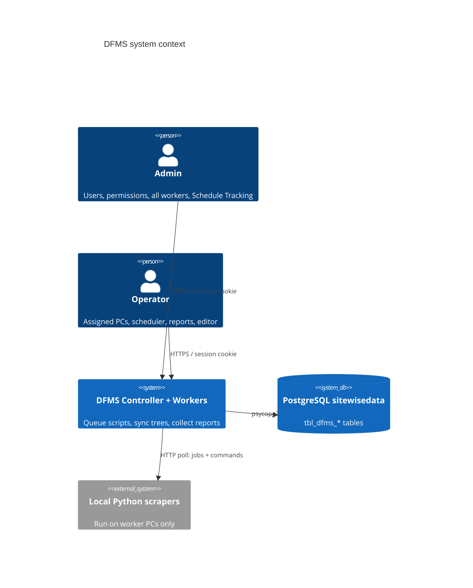
```mermaid
C4Context
    title DFMS system context
    Person(admin, "Admin", "Users, permissions, all workers, Schedule Tracking")
    Person(user, "Operator", "Assigned PCs, scheduler, reports, editor")
    System(dfms, "DFMS Controller + Workers", "Queue scripts, sync trees, collect reports")
    SystemDb(pg, "PostgreSQL sitewisedata", "tbl_dfms_* tables")
    System_Ext(scripts, "Local Python scrapers", "Run on worker PCs only")

    Rel(admin, dfms, "HTTPS / session cookie")
    Rel(user, dfms, "HTTPS / session cookie")
    Rel(dfms, pg, "psycopg2")
    Rel(dfms, scripts, "HTTP poll: jobs + commands")
```

### Containers

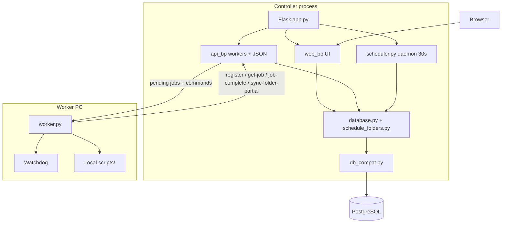
```mermaid
flowchart TB
    subgraph Controller["Controller process"]
        Flask["Flask app.py"]
        Web["web_bp UI"]
        API["api_bp workers + JSON"]
        Sch["scheduler.py daemon 30s"]
        DAL["database.py + schedule_folders.py"]
        Compat["db_compat.py"]
        Flask --> Web
        Flask --> API
        Flask --> Sch
        Web --> DAL
        API --> DAL
        Sch --> DAL
        DAL --> Compat
    end
    PG[(PostgreSQL)]
    Compat --> PG
    subgraph W1["Worker PC"]
        WP["worker.py"]
        WD["Watchdog"]
        PY["Local scripts/"]
        WP --> WD
        WP --> PY
    end
    Browser["Browser"] --> Web
    WP -->|"register / get-job / job-complete / sync-folder-partial"| API
    API -->|"pending jobs + commands"| WP
```

---

## 3. Deployment topology

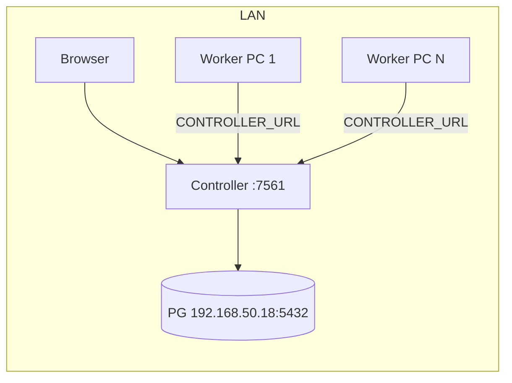
```mermaid
flowchart LR
    subgraph LAN
        B[Browser]
        C[Controller :7561]
        PG[(PG 192.168.50.18:5432)]
        P1[Worker PC 1]
        P2[Worker PC N]
    end
    B --> C
    C --> PG
    P1 -->|"CONTROLLER_URL"| C
    P2 -->|"CONTROLLER_URL"| C
```

- Controller bind: `CONTROLLER_HOST` / `CONTROLLER_PORT` (default `0.0.0.0:7561`).
- Worker identity: **IP** at register time; dashboard name is source of truth (`rename-worker` queues a command).
- Offline: no heartbeat for `WORKER_OFFLINE_SECONDS` (default 30).

---

## 4. Key design rules

- Controller never executes scrapers.
- Workers use local paths only.
- One **schedule** row is a recurring definition; each fire creates a new **job** row (`jobs.schedule_id`).
- Folder Scheduler members are **not** triggered as individual due schedules (`get_due_schedules` excludes them).
- File Explorer is DB-backed (`worker_file_tree`). Dashboard polls `GET /files/list` (~1.5s, `Cache-Control: no-store`). Worker prefers `POST /api/sync-folder-partial`.
- Users cannot be deleted; **Disable** revokes login.
- Worker detail / File Explorer live sync is treated as frozen unless explicitly changed.

---

## 5. Repository map

```
Distributed file management/
├── app.py                 Flask factory, scheduler start, template filters
├── config.py              Host, port, PG*, secrets from .env
├── database.py            DAL (logical SQL)
├── db_compat.py           PG rewrite + connection pool/thread local
├── scheduler.py           30s due-check thread
├── schedule_folders.py    Folder groups, sequential runs, folder ACL
├── init_db.py             Schema helper
├── routes/
│   ├── web_routes.py      Pages + form POSTs + editor poll
│   └── api_routes.py      Worker API + files + watchlist + tracking + folders
├── worker_agent/worker.py Canonical worker (deploy to PCs)
├── templates/             Jinja pages (base, dashboard, worker_detail, scheduler, …)
├── static/js|css          file_explorer, scheduler_folders, permissions, users, reports
├── postgres/              DDL review script + smoke tests
├── tests/                 scheduler, bulk, days, delete, perf, injection, load
└── other pc worker/       Alternate/copied worker (not the live source of truth)
```

---

## 6. Runtime module graph

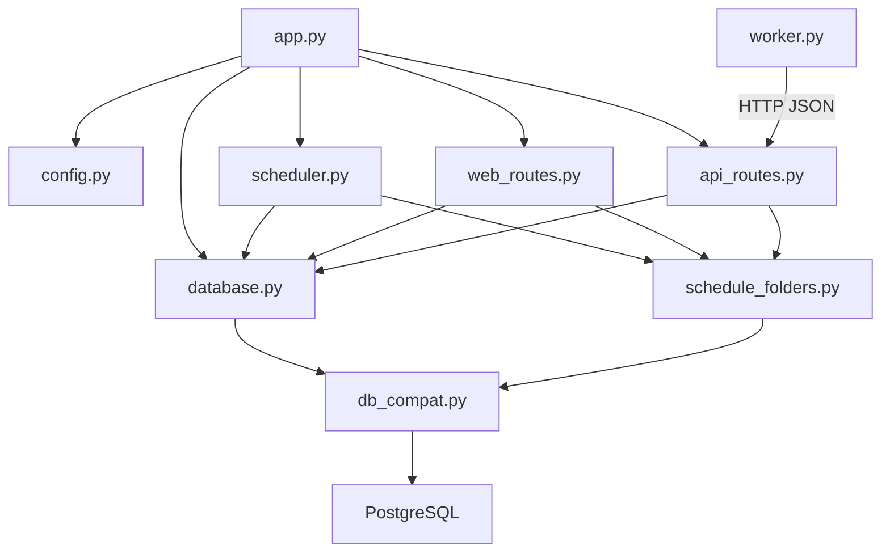
```mermaid
flowchart TB
    app.py --> config.py
    app.py --> database.py
    app.py --> web_routes.py
    app.py --> api_routes.py
    app.py --> scheduler.py
    scheduler.py --> database.py
    scheduler.py --> schedule_folders.py
    web_routes.py --> database.py
    web_routes.py --> schedule_folders.py
    api_routes.py --> database.py
    api_routes.py --> schedule_folders.py
    database.py --> db_compat.py
    schedule_folders.py --> db_compat.py
    db_compat.py --> PostgreSQL
    worker.py -->|"HTTP JSON"| api_routes.py
```

---

## 7. Operator UI map

Layout: `templates/base.html` sidebar + topbar (``).

| Route | Page | Who | Purpose |
|-------|------|-----|---------|
| `/login` `/register` `/logout` | Auth | All | Session; signed-in users redirected off login/register; `next` is a safe relative path |
| `/` | Home | Assigned PCs | Workers, run/stop/pause, KPIs |
| `/workers` | Workers | Accessible PCs | List |
| `/worker/<ip>` | Worker detail | PC access | File Explorer, config/path, live tree |
| `/scheduler` | Scheduler | ACL | Regular schedules + Folder Scheduler tabs |
| `/permissions` | Access Control | Admin | PC / script / schedule / folder / view-as grants |
| `/users` | Users | Admin | Create, edit, disable (no delete) |
| `/history` | Global History | Filtered | `history_log` + access periods |
| `/editor` | Remote editor | File ACL | Read/save via worker commands |
| `/diff/<id>` | File diff | File history | Old vs new content |
| `/reports` | Reports | Filtered | History, Analytics, Watchlist; admin Schedule Tracking |

---

## 8. Identity, auth, and permissions

### Auth flow

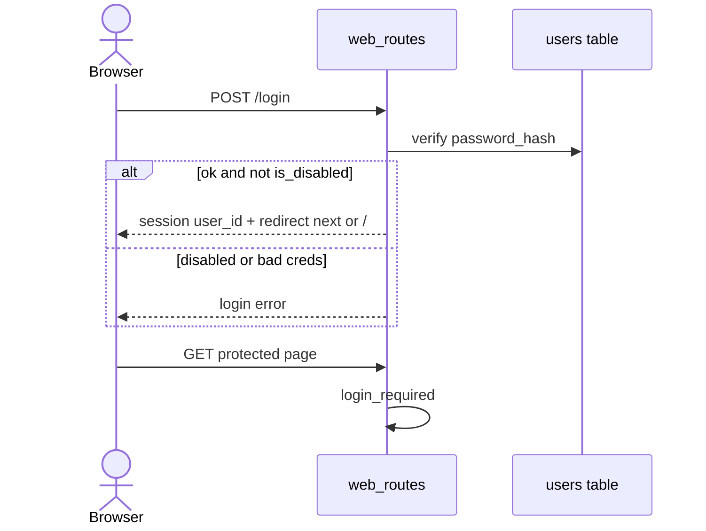
```mermaid
sequenceDiagram
    actor U as Browser
    participant W as web_routes
    participant D as users table
    U->>W: POST /login
    W->>D: verify password_hash
    alt ok and not is_disabled
        W-->>U: session user_id + redirect next or /
    else disabled or bad creds
        W-->>U: login error
    end
    U->>W: GET protected page
    W->>W: login_required
```

- Roles: `admin` | `user`.
- `can_set_days`: whether the user may edit script/schedule **days** fields.
- `is_disabled`: blocks login; user row remains.

### Permission layers (all must pass for an action)

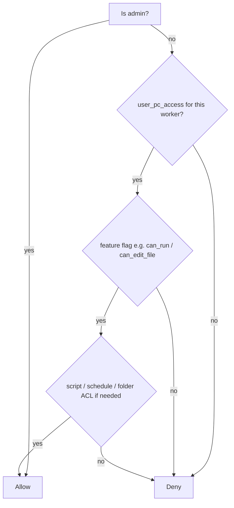
```mermaid
flowchart TB
    A[Is admin?] -->|yes| Allow[Allow]
    A -->|no| PC{user_pc_access for this worker?}
    PC -->|no| Deny
    PC -->|yes| Feat{feature flag e.g. can_run / can_edit_file}
    Feat -->|no| Deny
    Feat -->|yes| Extra{script / schedule / folder ACL if needed}
    Extra -->|yes| Allow
    Extra -->|no| Deny
```

| Table | Grants |
|-------|--------|
| `user_pc_access` | Worker: paths, extensions, folder/file CRUD, edit, run, access-all-files |
| `user_pc_access_periods` | History still visible after revoke (`started_at`–`ended_at`) |
| `user_script_access` | Per-script run/update/delete |
| `schedule_access` | Enable/disable/run/duplicate/edit/delete schedule |
| `schedule_folder_access` | Folder edit/run/members/manage |
| `scheduler_view_access` | View another user’s scheduler |

Admins bypass ACL. First user created is typically bootstrapped as admin in schema init.

---

## 9. Worker lifecycle

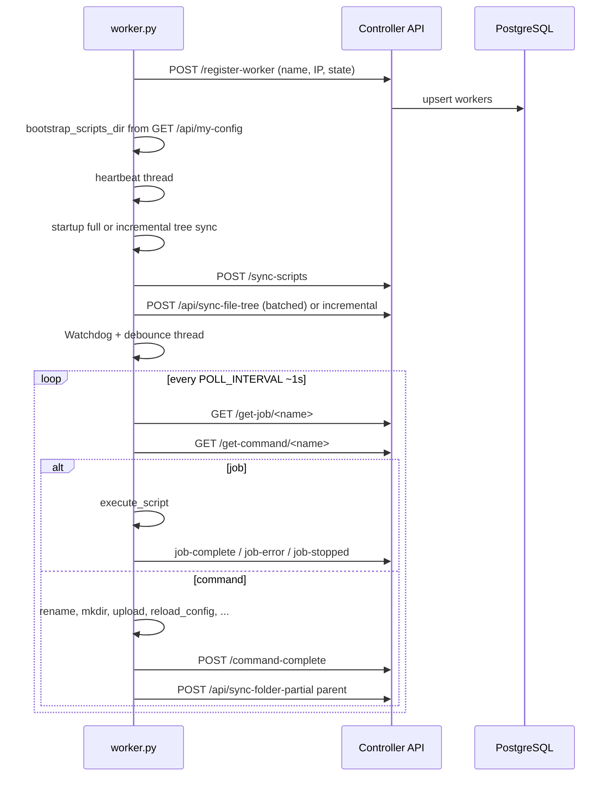
```mermaid
sequenceDiagram
    participant W as worker.py
    participant API as Controller API
    participant DB as PostgreSQL
    W->>API: POST /register-worker (name, IP, state)
    API->>DB: upsert workers
    W->>W: bootstrap_scripts_dir from GET /api/my-config
    W->>W: heartbeat thread
    W->>W: startup full or incremental tree sync
    W->>API: POST /sync-scripts
    W->>API: POST /api/sync-file-tree (batched) or incremental
    W->>W: Watchdog + debounce thread
    loop every POLL_INTERVAL ~1s
        W->>API: GET /get-job/<name>
        W->>API: GET /get-command/<name>
        alt job
            W->>W: execute_script
            W->>API: job-complete / job-error / job-stopped
        else command
            W->>W: rename, mkdir, upload, reload_config, ...
            W->>API: POST /command-complete
            W->>API: POST /api/sync-folder-partial parent
        end
    end
```

Heartbeat: `POST /register-worker` with `state` so `last_seen` stays fresh.

`reload_config`: dashboard saves `script_location` → command → worker switches `SCRIPTS_DIR`, full tree replace sync; UI may show sync-pending only for that path change.

---

## 10. Job execution (schedule vs jobs)

**One Scheduler row ≠ one progress-bar “job”.**  
Schedule = plan. Job = one execution. Daily script run 6 times → 1 schedule, 6 `jobs` rows.

### Create → claim → run → report

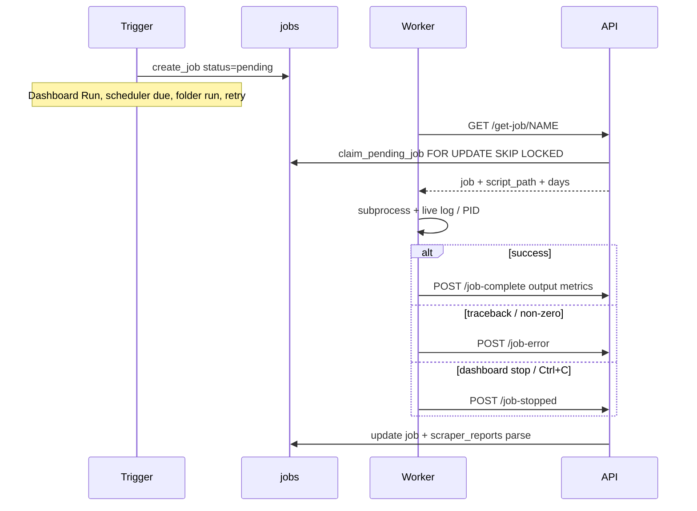
```mermaid
sequenceDiagram
    participant Src as Trigger
    participant DB as jobs
    participant W as Worker
    participant API as API
    Src->>DB: create_job status=pending
    Note over Src: Dashboard Run, scheduler due, folder run, retry
    W->>API: GET /get-job/NAME
    API->>DB: claim_pending_job FOR UPDATE SKIP LOCKED
    API-->>W: job + script_path + days
    W->>W: subprocess + live log / PID
    alt success
        W->>API: POST /job-complete output metrics
    else traceback / non-zero
        W->>API: POST /job-error
    else dashboard stop / Ctrl+C
        W->>API: POST /job-stopped
    end
    API->>DB: update job + scraper_reports parse
```

### Triggers that insert jobs

| Trigger | `schedule_id` | `folder_run_id` |
|---------|---------------|-----------------|
| Home / worker “Run” | optional | null |
| `scheduler.py` due regular schedule | set | null |
| Folder Scheduler start / next item | set | set |
| Retry job | copied | copied if any |

Folder members are skipped by `get_due_schedules`; they run only as part of a folder sequential run.

### Job statuses (typical)

`pending` → `running` → `completed` | `error` | `stopped`  
Also: `paused` / resume; stale auto-resume and reconcile endpoints exist for worker crash recovery.

---

## 11. File Explorer live sync

**Contract (must keep working):**

1. FS change on worker → Watchdog debounce → `POST /api/sync-folder-partial` (preferred) → DB folder replace.
2. Dashboard `GET /files/list` ~1.5s, `cache: 'no-store'`, re-render on data change.
3. Path/config change → `reload_config` → worker applies path + resync; sync-pending UI only for that flow.
4. Dashboard file ops still push parent-folder sync after the command completes.

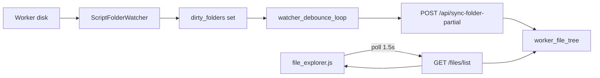
```mermaid
flowchart LR
    FS[Worker disk] --> WD[ScriptFolderWatcher]
    WD --> Dirty[dirty_folders set]
    Dirty --> Debounce[watcher_debounce_loop]
    Debounce --> Partial[POST /api/sync-folder-partial]
    Partial --> WFT[worker_file_tree]
    UI[file_explorer.js] -->|poll 1.5s| List[GET /files/list]
    List --> WFT
    List --> UI
```

Full sync: walk tree, batch `POST /api/sync-file-tree`, `worker_tree_sync` tracks status/batches. Watcher pauses during heavy full sync so events queue, then flush partials.

`GET /files/list` applies `user_pc_access` path/extension filters for non-admins.

---

## 12. Remote file operations and editor

Dashboard does **not** write the worker disk itself. It inserts a `commands` row; the worker polls `GET /get-command/<name>`, executes, `POST /command-complete`.

Typical commands: create/rename/delete folder or file, upload, update, move, refresh tree, rename worker, `reload_config`, editor read/save.

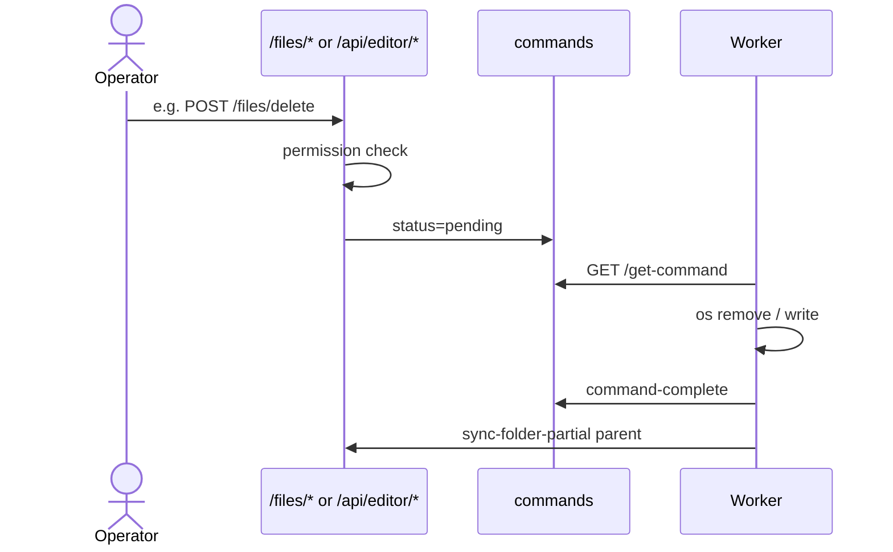
```mermaid
sequenceDiagram
    actor U as Operator
    participant Web as /files/* or /api/editor/*
    participant Cmd as commands
    participant W as Worker
    U->>Web: e.g. POST /files/delete
    Web->>Web: permission check
    Web->>Cmd: status=pending
    W->>Cmd: GET /get-command
    W->>W: os remove / write
    W->>Cmd: command-complete
    W->>Web: sync-folder-partial parent
```

Editor: `POST /api/editor/read_path` or `/save_path` → command → `GET /api/editor/poll/<cmd_id>`. Saves append `file_history` for `/diff/<history_id>`.

---

## 13. Scheduler and Folder Scheduler

### Regular schedule types

Stored on `schedules.schedule_type` + `schedule_config` JSON + `run_time`:

| Type | Behavior |
|------|----------|
| `daily` | Fire at `run_time` (HH:MM) |
| `interval` | Every N minutes; optional **time range** window in config |
| `weekly` | Days of week + time |
| `monthly` | Day-of-month + time (due check uses date+time, not time-only) |
| `once` | Single fire; catch-up same minute allowed |

`days` on schedule/script: scraper “how many days back”. Hidden in UI unless selected scripts have a days variable. Daily reset of scheduler days at **13:30 UTC (7:00 PM IST)**.

Create: `POST /scheduler/create` → `schedules` + creator `schedule_access` (no delete by default). Edit requires admin or owner/`can_edit`. Soft delete: `is_deleted=1`.

Drawer performance: Python-only list, exclude venv/`site-packages`, rank filename matches, render 75 then infinite scroll; search over full set.

### Folder Scheduler

`schedule_folders` + `schedule_folder_items` (ordered members) + `schedule_folder_runs`.

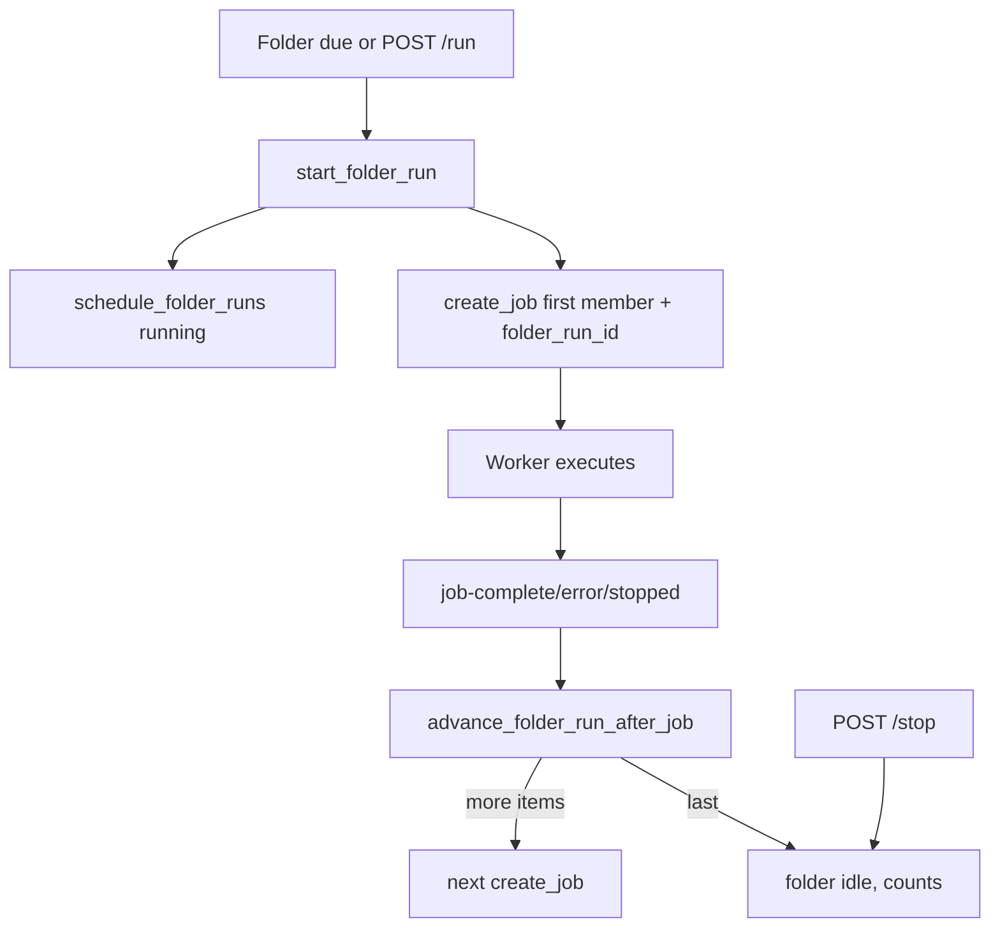
```mermaid
flowchart TB
    Due[Folder due or POST /run] --> Start[start_folder_run]
    Start --> RunRow[schedule_folder_runs running]
    Start --> J1[create_job first member + folder_run_id]
    J1 --> Worker[Worker executes]
    Worker --> Done[job-complete/error/stopped]
    Done --> Adv[advance_folder_run_after_job]
    Adv -->|more items| J2[next create_job]
    Adv -->|last| Idle[folder idle, counts]
    Stop[POST /stop] --> Idle
```

Regular Scheduler tab **excludes** folder members so the two UIs stay separate.

---

## 14. Reports, Watchlist, Schedule Tracking

Page filters (`#reportsFiltersForm`): worker, status, time range / From–To, folder path. Title lives in the **top bar** (`Reports & Analytics`). Compact filter bar. History table page size 10/25/50/100.

### Tab 1 — Execution History

Paginated `scraper_reports` (plus job metrics). Scoped by worker ACL for non-admins.

On job complete/error, controller parses log → `scraper_reports`, `scraper_report_errors`, `scraper_report_files`.

### Tab 2 — Analytics

Same filter window: completion %, common errors, failed scripts, problem files (star → watchlist). Uses report data (and fallbacks if normalized error tables are empty).

### Tab 3 — Watchlist

`file_watchlist` rows. **Add folder** picker (`#wlFolderContainer`) has two lists:

1. **Scheduler folders** — parent directories of that worker’s **scheduled script paths**. New script → folder appears; last script gone → folder drops. `GET /api/watchlist/scheduler-folders`. Not expandable.
2. **Worker folders** — live `/files/list` tree. Expandable. File Explorer contract unchanged.

### Tab 4 — Schedule Tracking (admin only)

`GET /api/admin/schedule-tracking` → users as containers.

```
User (click opens; no inline expand)
├── Scheduler Folders (expand → member scripts)
└── Individual Scripts (flat; not folder members)
```

Progress bar = **completed jobs / total jobs** for that schedule (or summed for folder/user).  
Completed = `jobs.status IN ('completed','success')`. No jobs → `0.0% · 0/0`.  
From/To on this tab limits which job rows count. Badge = latest tracking status (Pending / In Progress / Completed / Failed), independent of percent.

---

## 15. PostgreSQL data model

Physical names: `tbl_dfms_<logical>`. 24 tables in the review DDL.

### ER (core)

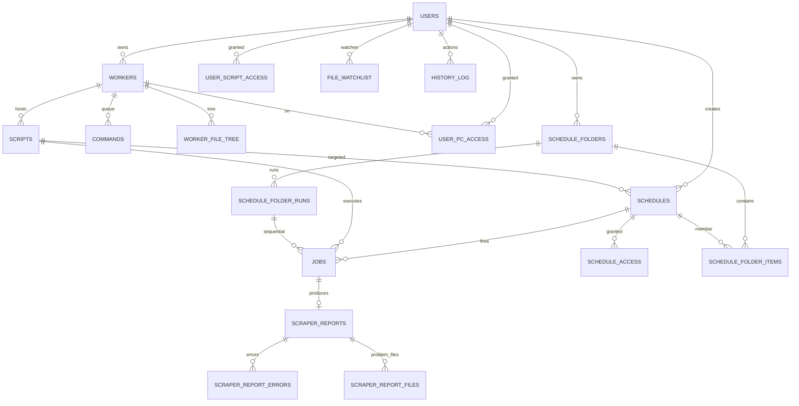
```mermaid
erDiagram
    USERS ||--o{ WORKERS : owns
    USERS ||--o{ SCHEDULES : creates
    WORKERS ||--o{ SCRIPTS : hosts
    SCRIPTS ||--o{ SCHEDULES : targeted
    SCHEDULES ||--o{ JOBS : fires
    SCRIPTS ||--o{ JOBS : executes
    WORKERS ||--o{ COMMANDS : queue
    WORKERS ||--o{ WORKER_FILE_TREE : tree
    USERS ||--o{ USER_PC_ACCESS : granted
    WORKERS ||--o{ USER_PC_ACCESS : on
    USERS ||--o{ USER_SCRIPT_ACCESS : granted
    SCHEDULES ||--o{ SCHEDULE_ACCESS : granted
    USERS ||--o{ SCHEDULE_FOLDERS : owns
    SCHEDULE_FOLDERS ||--o{ SCHEDULE_FOLDER_ITEMS : contains
    SCHEDULES ||--o{ SCHEDULE_FOLDER_ITEMS : member
    SCHEDULE_FOLDERS ||--o{ SCHEDULE_FOLDER_RUNS : runs
    SCHEDULE_FOLDER_RUNS ||--o{ JOBS : sequential
    JOBS ||--o| SCRAPER_REPORTS : produces
    SCRAPER_REPORTS ||--o{ SCRAPER_REPORT_ERRORS : errors
    SCRAPER_REPORTS ||--o{ SCRAPER_REPORT_FILES : problem_files
    USERS ||--o{ FILE_WATCHLIST : watches
    USERS ||--o{ HISTORY_LOG : actions
```

### Table catalog

| Logical name | Role |
|--------------|------|
| `users` | Login, role, nickname, IPs, can_set_days, is_disabled |
| `workers` | Name, IP unique, status/state, script_location, env_details, last_seen, owner |
| `scripts` | Per worker+basename unique; path, days, type, star |
| `schedules` | Recurrence, enabled, soft delete, config JSON |
| `jobs` | Execution: status, output, PID, duration, counts, schedule_id, folder_run_id |
| `commands` | Worker command queue |
| `user_pc_access` | Worker feature flags + path/ext allowlists |
| `user_pc_access_periods` | History visibility windows |
| `user_script_access` | Script ACL |
| `schedule_access` | Schedule ACL |
| `schedule_folders` / `_items` / `_runs` / `_access` | Folder Scheduler |
| `scheduler_view_access` | View another user’s schedules |
| `history_log` | Audit trail |
| `worker_file_tree` | Flat path rows: parent_path, type, size, mtime |
| `worker_tree_sync` | Full-sync progress |
| `file_history` | Editor diffs |
| `user_starred_files` | Explorer stars |
| `file_watchlist` | Reports watchlist |
| `scraper_reports` / `_errors` / `_files` | Parsed run reports |

---

## 16. HTTP API catalog

### Worker-facing (no browser session; worker HTTP)

| Method | Path | Purpose |
|--------|------|---------|
| POST | `/register-worker` | Upsert worker + heartbeat |
| POST | `/sync-scripts` | Replace script catalog for worker |
| GET | `/get-job/<worker_name>` | Claim oldest pending job |
| GET | `/job-status/<id>` | Single job |
| POST | `/job-status-batch` | Many jobs |
| POST | `/job-live-log` | Streaming output |
| POST | `/job-update-pid` | OS PID |
| GET | `/get-command/<worker_name>` | Next pending command |
| POST | `/command-complete` | Command result |
| POST | `/job-complete` | Success + metrics → reports |
| POST | `/job-error` | Failure |
| POST | `/job-stopped` | User/PC stop |
| POST | `/job-paused` `/job-resumed` | Pause/resume |
| POST | `/auto-resume-stale` | Recover stale paused |
| POST | `/reconcile-running-jobs` | Worker vs DB running set |
| POST | `/api/sync-file-tree` | Full/batch tree |
| POST | `/api/sync-folder-partial` | One folder replace |
| GET | `/api/my-config` | Worker pulls script_location etc. |

### Dashboard JSON (session)

| Method | Path | Purpose |
|--------|------|---------|
| GET | `/api/workers` `/api/stats` | Live home widgets |
| GET | `/files/list` | Explorer listing (ACL, no-store) |
| POST | `/files/star` `create_folder` `rename_folder` `delete_folder` `upload` `update` `delete` `rename_file` `refresh` `move` | Queue file commands |
| GET | `/files/types` | Type filter options |
| GET/POST | `/api/worker-config/<name>` | Path/config; POST may queue reload_config |
| GET | `/api/schedules/list` | Scheduler table JSON |
| POST | `/api/schedule/<id>/days` `/time` | Inline edits |
| POST | `/api/script/<id>/days` | Script days |
| GET/POST/PATCH/DELETE | `/api/schedule-folders` … | Folder CRUD, items, reorder, bulk, run, stop |
| GET | `/api/schedules/unassigned` | Scripts not in a folder |
| POST | `/watchlist/toggle` | Star/unstar watch |
| GET | `/api/watchlist` | Watchlist payload |
| GET | `/api/watchlist/scheduler-folders` | Scheduler path folders for picker |
| GET | `/api/admin/schedule-tracking` | Admin tracking tree |
| GET | `/api/permissions/catalog` | Permissions UI catalog |
| POST | `/api/editor/read` `read_path` `save` `save_path` | Editor commands |
| GET | `/api/editor/poll/<cmd_id>` | Wait for worker |

### Form / page POSTs (session)

Register, login, logout, rename-worker, run/retry/stop/pause/resume job, permissions save, revoke PC/script access, scheduler create/update/delete, bulk-update-schedules, profile update, users create/edit/toggle-disabled.

---

## 17. Configuration and environment

| Variable | Default / notes |
|----------|-----------------|
| `CONTROLLER_HOST` `CONTROLLER_PORT` | `0.0.0.0` / `7561` |
| `PGHOST` `PGPORT` `PGDATABASE` `PGUSER` `PGPASSWORD` `PGSCHEMA` | Company Postgres |
| `WORKER_OFFLINE_SECONDS` | `30` |
| `FLASK_SECRET_KEY` | Change in production |
| `WORKER_ROOT` | Legacy uploads; live tree is DB |
| Worker `CONTROLLER_URL` | e.g. `http://192.168.50.89:7561` |
| Worker `POLL_INTERVAL` | Default `1` second |

`.env` loaded without overriding existing OS env (`config._load_dotenv`).

---

## 18. State machines

### Worker

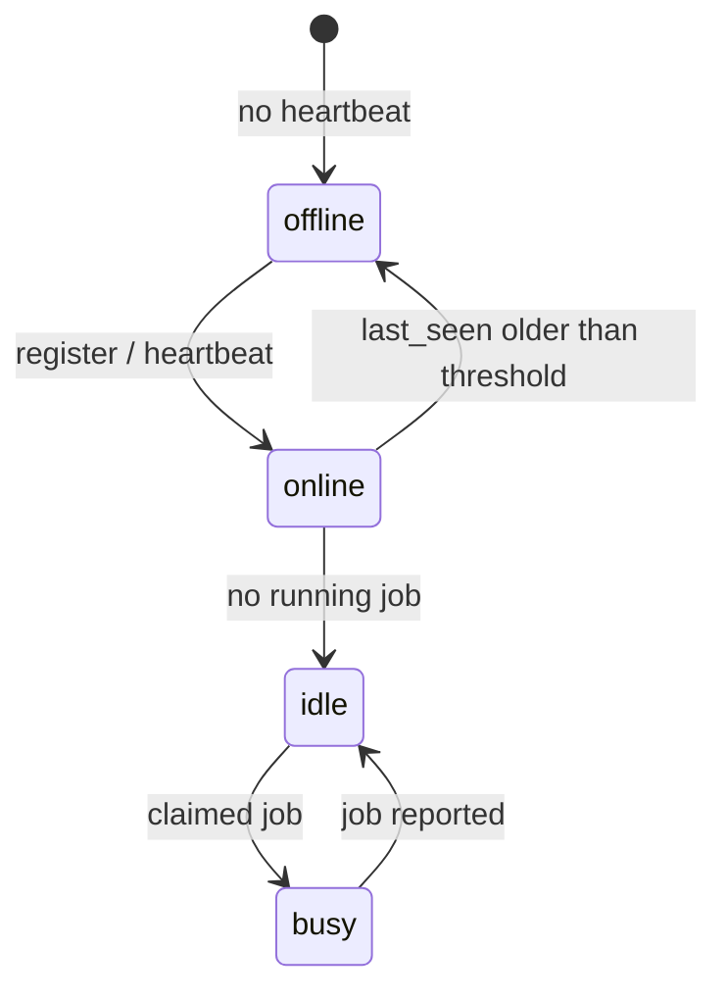
```mermaid
stateDiagram-v2
    [*] --> offline: no heartbeat
    offline --> online: register / heartbeat
    online --> idle: no running job
    idle --> busy: claimed job
    busy --> idle: job reported
    online --> offline: last_seen older than threshold
```

Dashboard `status` = online/offline from `last_seen`; `state` = idle/busy from worker.

### Job

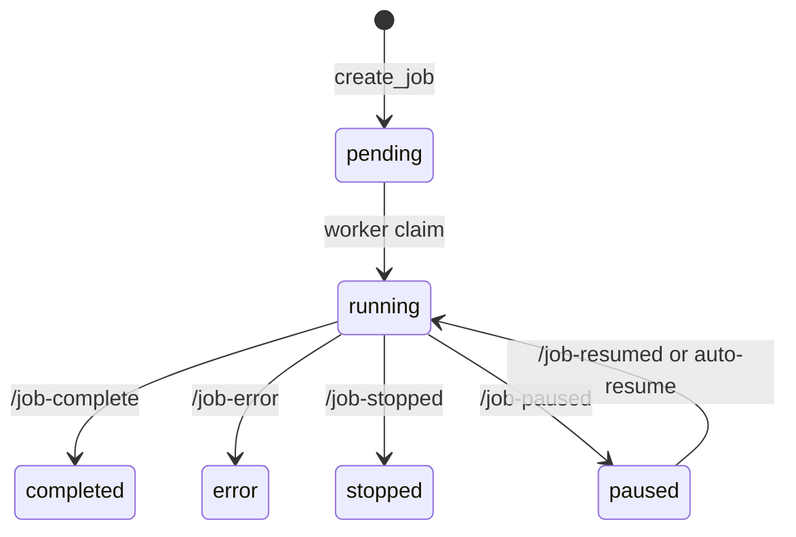
```mermaid
stateDiagram-v2
    [*] --> pending: create_job
    pending --> running: worker claim
    running --> completed: /job-complete
    running --> error: /job-error
    running --> stopped: /job-stopped
    running --> paused: /job-paused
    paused --> running: /job-resumed or auto-resume
```

### Folder run

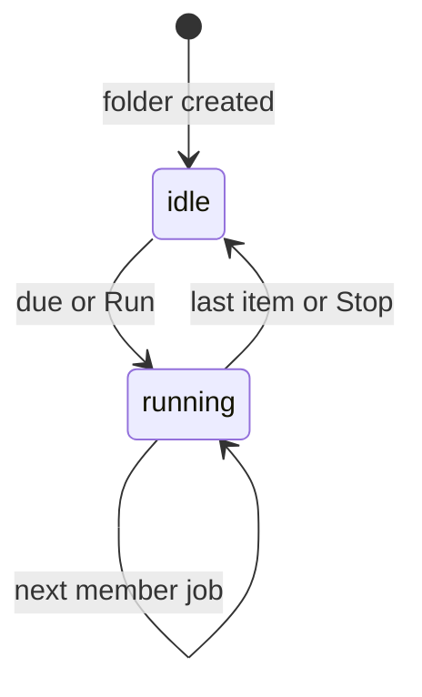
```mermaid
stateDiagram-v2
    [*] --> idle: folder created
    idle --> running: due or Run
    running --> running: next member job
    running --> idle: last item or Stop
```

### Schedule Tracking status (badge)

Priority when aggregating children: **in_progress** > **failed** > all **completed** → completed, else **pending**.

---

## 19. End-to-end user journeys

### Admin assigns a PC and runs a script

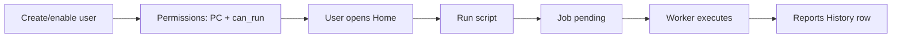
```mermaid
flowchart LR
    A[Create/enable user] --> B[Permissions: PC + can_run]
    B --> C[User opens Home]
    C --> D[Run script]
    D --> E[Job pending]
    E --> F[Worker executes]
    F --> G[Reports History row]
```

### Operator schedules daily work

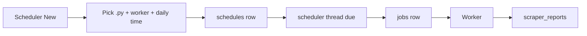
```mermaid
flowchart LR
    A[Scheduler New] --> B[Pick .py + worker + daily time]
    B --> C[schedules row]
    C --> D[scheduler thread due]
    D --> E[jobs row]
    E --> F[Worker]
    F --> G[scraper_reports]
```

### Admin tracks a user

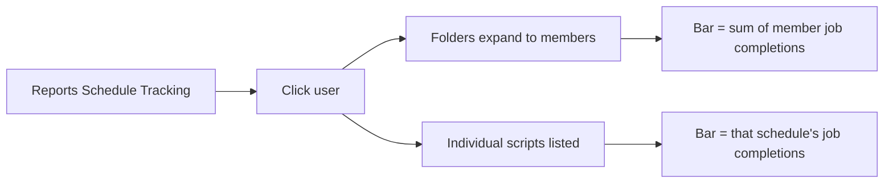
```mermaid
flowchart LR
    A[Reports Schedule Tracking] --> B[Click user]
    B --> C[Folders expand to members]
    B --> D[Individual scripts listed]
    C --> E[Bar = sum of member job completions]
    D --> E2[Bar = that schedule's job completions]
```

### Edit a file on a worker

Explorer or Editor → command → worker write → `file_history` → optional Diff; parent folder partial sync → Explorer poll updates.

---

## 20. Data flow summary

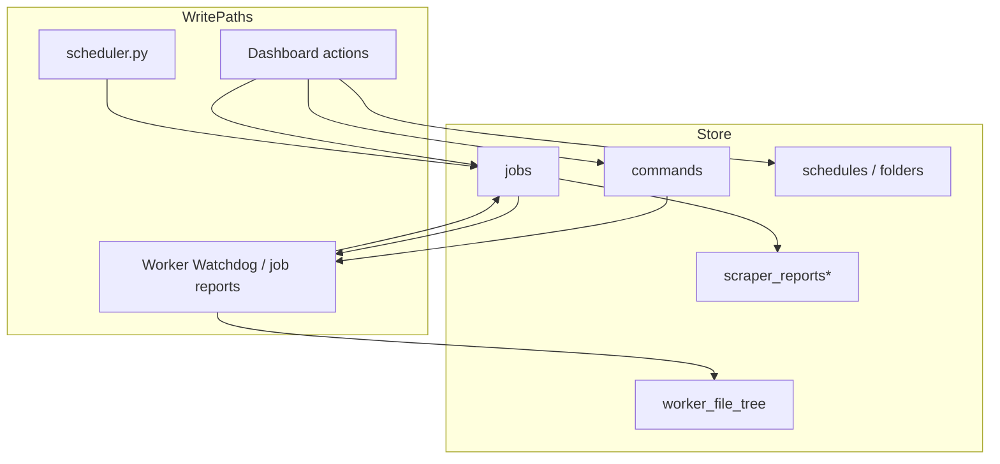
```mermaid
flowchart TB
    subgraph WritePaths
        UI[Dashboard actions]
        SCH[scheduler.py]
        W[Worker Watchdog / job reports]
    end
    subgraph Store
        J[jobs]
        C[commands]
        T[worker_file_tree]
        R[scraper_reports*]
        S[schedules / folders]
    end
    UI --> J
    UI --> C
    UI --> S
    SCH --> J
    W --> T
    W --> J
    J --> R
    C --> W
    J --> W
```

---

## 21. Security and operational notes

- Sessions: Flask `SECRET_KEY`; HTML responses `Cache-Control: no-store`.
- Passwords: hashed in `users.password_hash`.
- SQL: parameterized; `db_compat` rewrites identifiers, not user values.
- File ops: path confinement to worker `SCRIPTS_DIR` + ACL paths/extensions.
- Worker API is unauthenticated HTTP on the LAN — treat as trusted network; do not expose `:7561` to the internet without extra auth.
- Soft-delete schedules/folders; users are disabled, not deleted.
- Controller `debug=True` in `app.py` `__main__` — disable in production.

---

## 22. Tests and known frozen surfaces

| Area | Location |
|------|----------|
| Scheduler due / create | `tests/test_scheduler.py` |
| Days field | `tests/test_days.py` |
| Bulk actions | `tests/test_bulk.py` |
| Delete semantics | `tests/test_delete.py` |
| Perf smoke | `tests/test_perf.py` |
| Injection | `tests/test_injection.py` |
| Load | `tests/run_load_test.py` |
| PG smoke | `postgres/smoke_test.py`, `smoke_dashboard.py` |

**Frozen worker-detail contract:** `templates/worker_detail.html`, `static/js/file_explorer.js`, `static/css/file_explorer.css`, `/files/list`, `/api/sync-folder-partial`, `/api/sync-file-tree`, worker watcher/`reload_config`, related `worker_file_tree` helpers. Do not change poll interval, partial sync, or `no-store` without an explicit request.

---

## Appendix A — Process threads (controller vs worker)

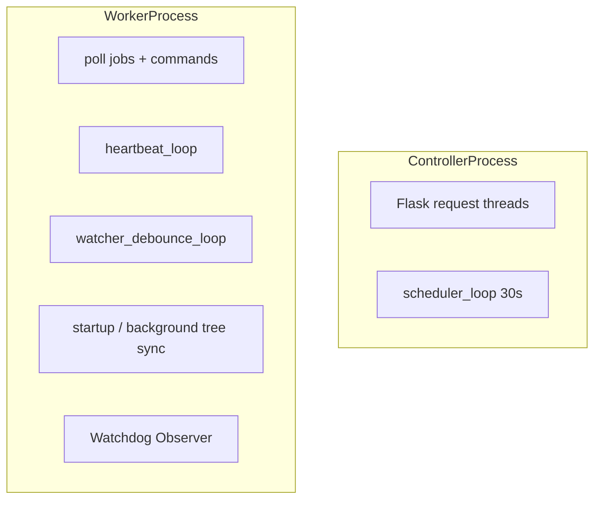
```mermaid
flowchart TB
    subgraph ControllerProcess
        GunicornOrFlask[Flask request threads]
        SchedThread[scheduler_loop 30s]
    end
    subgraph WorkerProcess
        Main[poll jobs + commands]
        HB[heartbeat_loop]
        Deb[watcher_debounce_loop]
        Sync[startup / background tree sync]
        Obs[Watchdog Observer]
    end
```

## Appendix B — Schedule Tracking progress formula

\[
\text{completion\_pct} = 100 \times \frac{\text{COUNT jobs where status} \in \{\text{completed}, \text{success}\}}{\text{COUNT all jobs for this schedule\_id}}
\]

Optional date filter: `COALESCE(start_time, created_at)` within From/To. Folder/user bars sum child totals. Badge uses latest job status mapping (`running` → In Progress).

## Appendix C — Related older docs

`README.md` still mentions SQLite in places; **current runtime is PostgreSQL** via `db_compat.py`. Historical notes live under `last_update/`. Schema source of truth for create: `postgres/01_create_schema_REVIEW_ONLY.sql`.
