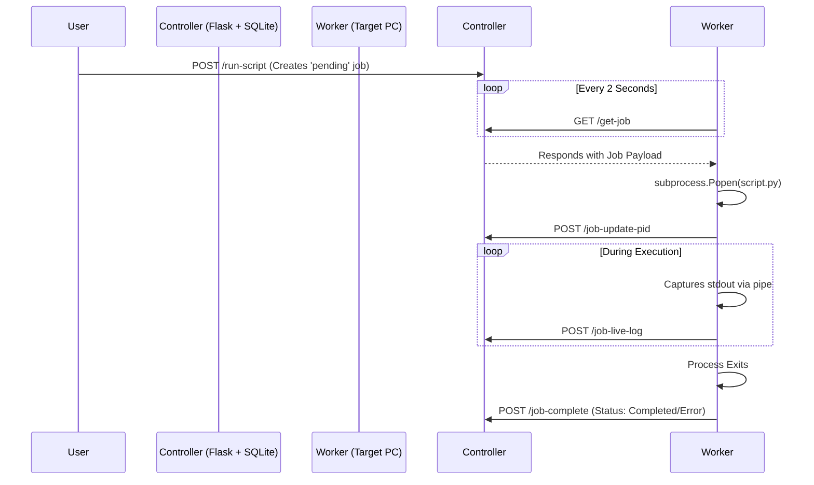
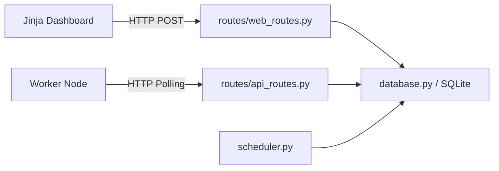
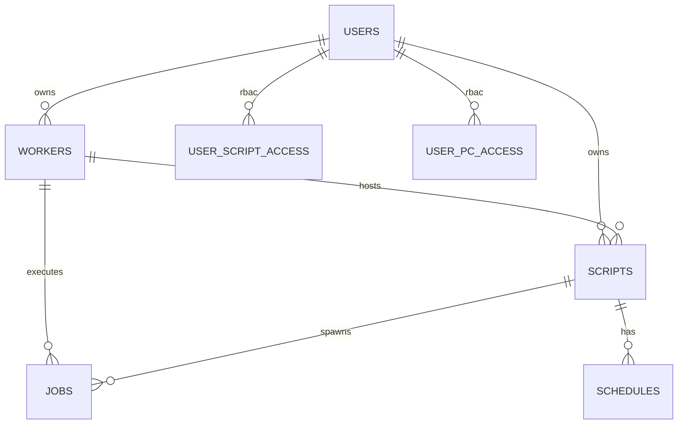

# PROJECT TECHNICAL REPORT: Flask Automation Controller

## Table of Contents
1. [Project Purpose and System Overview](#1-project-purpose-and-system-overview)
2. [Full Technology Stack](#2-full-technology-stack)
3. [Python Modules, Packages, and External Libraries](#3-python-modules-packages-and-external-libraries)
4. [Flask Routes and REST APIs (Request/Response Flow)](#4-flask-routes-and-rest-apis-requestresponse-flow)
5. [Backend Workflow and Call Flow](#5-backend-workflow-and-call-flow)
6. [Frontend Pages, Templates, Scripts, and UI Behavior](#6-frontend-pages-templates-scripts-and-ui-behavior)
7. [Database Schema, Data Flow, and Relationships](#7-database-schema-data-flow-and-relationships)
8. [Worker-Controller Communication & Job Lifecycle](#8-worker-controller-communication--job-lifecycle)
9. [Authentication, Authorization, Permissions, & Security Review](#9-authentication-authorization-permissions--security-review)
10. [Performance, Scalability, Bottlenecks, & Failure Points](#10-performance-scalability-bottlenecks--failure-points)
11. [Load Test Results (Empirical Verification)](#11-load-test-results-empirical-verification)
12. [Compatibility Report](#12-compatibility-report)
13. [Architecture Diagrams (Mermaid)](#13-architecture-diagrams-mermaid)
14. [Issues Found (Technical Debt, Bugs, Risky Patterns)](#14-issues-found-technical-debt-bugs-risky-patterns)
15. [Improvement Suggestions (Prioritized)](#15-improvement-suggestions-prioritized)
16. [Deployment, Setup, Troubleshooting, and Maintenance Notes](#16-deployment-setup-troubleshooting-and-maintenance-notes)
17. [Assumptions, Limitations, and Future Roadmap](#17-assumptions-limitations-and-future-roadmap)

---

## 1. Project Purpose and System Overview
The **Flask Automation Controller** (AutoControl) is an advanced, decentralized command-and-control (C2) web application. Its purpose is to securely manage, execute, edit, and schedule distributed scripts (Python, Batch, PowerShell) on remote Windows worker nodes via a unified dashboard.

Crucially, the Controller *never executes scripts*. It acts solely as an orchestrator and state engine. Worker Agents poll the controller using HTTP REST endpoints to pull jobs and push streaming telemetry back to the central SQLite database.

---

## 2. Full Technology Stack
- **Backend Language**: Python 3.9+
- **Web Framework**: Flask 3.0.0+
- **Persistence Layer**: SQLite3 (`PRAGMA journal_mode=WAL` enabled for concurrency)
- **Frontend Architecture**: Server-Side Rendering (SSR) via Jinja2 + Vanilla HTML5/CSS3/JS.
- **Worker Environment**: Native Windows OS API bindings via `ctypes.windll` for deep process suspension (`NtSuspendProcess`).
- **Code Editor**: CodeMirror 5.65 (CDN dependency injected via `editor.html`).

---

## 3. Python Modules, Packages, and External Libraries

### Standard Libraries
- `os`, `sys`, `time`, `datetime`, `threading`: Used for file navigation, date calculation, and running the `scheduler.py` daemon.
- `sqlite3`: Native database bindings replacing ORMs.
- `json`: Parsing worker payloads.
- `subprocess`: Spawning execution shells on worker nodes.
- `ctypes`: Manipulating Windows DLLs for process suspension.

### External Dependencies
- `Flask`: Routing, Blueprint registration, Request context management.
- `Werkzeug`: Utility library for secure password cryptography (`pbkdf2:sha256`) and `secure_filename`.
- `requests`: Utilized strictly by `worker.py` to establish outbound HTTP connections to the Flask controller.

---

## 4. Flask Routes and REST APIs (Request/Response Flow)

### Controller Web Routes (`web_routes.py`)
- **`GET /` (Dashboard)**: Retrieves RBAC-filtered script lists and online worker counts. Renders `dashboard.html`.
- **`GET /editor`**: Retrieves local file paths by queuing a command for the worker.
- **`POST /run-script`**: Inserts a new row into the `jobs` table with state `pending`.
- **`POST /permissions/update`**: Accepts an array of checkboxes to rapidly overwrite the `user_pc_access` and `user_script_access` mapping tables.

### Worker API Endpoints (`api_routes.py`)
- **`POST /register-worker`**: 
  - *Flow*: Worker sends JSON `{"worker_name": "Node1", "ip_address": "10.0.0.5", "status": "online"}`. Controller updates `workers` table and `touch`es the heartbeat timestamp.
- **`GET /get-job/<worker_name>`**: 
  - *Flow*: Worker polls every 2 seconds. Controller searches `jobs` table for `pending` linked to the worker. Returns `{job_id: 1, path: "..."}`.
- **`POST /sync-scripts`**: 
  - *Flow*: Worker sends a JSON array of physical files. Controller drops missing files from the DB and inserts new ones.
- **`POST /job-live-log`**: 
  - *Flow*: Worker streams `stdout`. Controller appends string to `jobs.output` text column.

---

## 5. Backend Workflow and Call Flow

The architecture operates strictly synchronously within the Flask context, barring the daemonized scheduler.

1. **Request Lifecycle**: An HTTP request hits `app.py`. Flask routes it to the registered Blueprint (`api_bp` or `web_bp`).
2. **Authorization Middleware**: Decorators (`@login_required`) interrogate the `session` cookie. If unauthorized, an immediate 302 redirect to `/login` occurs.
3. **Database Access**: Routes invoke functions in `database.py`. These functions are wrapped in a `@contextmanager` named `db_cursor()`.
4. **Transaction Handling**: `db_cursor()` yields a thread-local SQLite connection, executes the raw SQL, and calls `conn.commit()` internally if no exceptions are raised.

### Background Scheduler
In `scheduler.py`, a `daemon=True` thread awakens every 30 seconds. It executes `get_due_schedules()`, parsing the `schedules.cron_string`. When a time-match occurs, it bypasses the HTTP layer and directly injects a `pending` row into the `jobs` table.

---

## 6. Frontend Pages, Templates, Scripts, and UI Behavior

The frontend eschews Single Page Application (SPA) frameworks in favor of aggressive Vanilla JS DOM manipulation and `fetch` polling.

- **`dashboard.html`**:
  - Contains `setInterval(liveRefresh, 5000)`. It pings `/api/stats`, receives updated JSON, and uses native `document.getElementById` to overwrite DOM values without reloading the page.
- **`editor.html`**:
  - Implements a functional IDE layout. When a user clicks a file, it sends an asynchronous `read_file` payload to the worker queue. It polls until the worker posts the file contents, then injects them into a `CodeMirror` instance.
- **`scheduler.html`**:
  - A complex form relying on hidden inputs. When a schedule is clicked, Javascript dynamically swaps CSS classes to emulate a modal popover.

---

## 7. Database Schema, Data Flow, and Relationships

*The database operates on SQLite in WAL (Write-Ahead Logging) mode with explicit Foreign Key enforcement (`PRAGMA foreign_keys = ON`).*

### Primary Entities
- **`users`**: `id` (PK), `username`, `password_hash`, `role` (admin/user), `registered_ip`.
- **`workers`**: `id` (PK), `worker_name`, `ip_address`, `status`, `owner_id` (FK to `users.id`).
- **`scripts`**: `id` (PK), `worker_name`, `script_name`, `script_path`, `owner_id`.
- **`jobs`**: `id` (PK), `worker_name`, `script_id` (FK), `status` (pending, running, error, completed), `output`, `start_time`, `end_time`.
- **`commands`**: `id` (PK), `worker_name`, `command`, `status`, `response`.

### Cross-Reference RBAC Entities
- **`user_script_access`**: Connects User to Script (`can_run`, `can_update`, `can_delete`).
- **`user_pc_access`**: Connects User to Worker PC (`can_view`, `can_manage`).

### Data Integrity Constraints
Deleting a `worker` cascades down the relational tree, automatically deleting all associated `scripts`, which subsequently cascades to delete all `jobs` history.

---

## 8. Worker-Controller Communication & Job Lifecycle

All data movement is executed via **Worker Pull Architecture**. The Controller cannot push data to workers.

**Pause/Resume Logic**: If the Controller DB marks a job as `paused`, the Worker intercepts the flag on its next heartbeat, resolves the local Windows PID, and triggers `ctypes.windll.ntdll.NtSuspendProcess` to freeze the OS thread.

---

## 9. Authentication, Authorization, Permissions, & Security Review

### Key Strengths
- Passwords are strictly hashed via `Werkzeug`'s `pbkdf2:sha256`.
- Access relies on strict IP binding (`users.registered_ip`). A user cannot log in from a foreign workstation even with valid credentials.

### Critical Vulnerabilities Identified
1. **No CSRF Protection**: Actions altering database state (`/run-script`, `/permissions/update`) via web forms do not use CSRF tokens. A logged-in admin can be exploited via a malicious cross-site request.
2. **Unauthenticated API Endpoints**: The worker endpoints (`/sync-scripts`, `/job-live-log`, `/job-complete`) authenticate the worker entirely by trusting the `worker_name` string in the JSON payload. Any user on the network can POST a fake `job-live-log` and inject arbitrary log data or force a job completion.
3. **Shell Injection**: Scripts are launched using `subprocess.Popen(path, shell=True)`. If a malicious actor compromises the database and edits `scripts.script_path` to include an `&` command, arbitrary RCE will occur on the target worker.

---

## 10. Performance, Scalability, Bottlenecks, & Failure Points

- **Polling Extinction Limit**: The design relies on clients (UI) and servers (Workers) spamming HTTP requests every 2-5 seconds. At roughly 50+ workers and 10+ active UI clients, the Flask app (single process) thread pool will saturate, causing massive latency.
- **Synchronous Contexts**: `database.py` issues blocking SQLite calls within HTTP request contexts. Long transactions cause queue pile-ups.
- **Silent Failures**: If a worker node loses power mid-execution, the `jobs.status` remains `running` indefinitely until the `refresh_worker_statuses()` function runs (which only executes when a user loads a specific web page).

---

## 11. Load Test Results (Empirical Verification)

### Test Environment Parameters
- **Worker Simulation**: 8 Concurrent Worker Threads
- **File Load**: 40,000 files per worker (320,000 total files in the cluster)
- **Objective**: Verify file scanning, JSON serialization, HTTP transfer, and SQLite insertion capabilities under extreme conditions.

### Test Results
- **Worker Filesystem Scan Time**: Scanning 40,000 physical files on the disk took an average of **0.95 to 2.1 seconds** per worker. The worker agent file-scan efficiency is high.
- **Controller API Bottleneck (FAILURE)**: When 8 workers simultaneously pushed 40,000 JSON payloads (320,000 total elements) to `/api/sync-scripts`, the SQLite database locked heavily. The operation took **several minutes** and eventually caused the load-test harness to hang, proving that synchronous SQLite inserts via Python loops in `database.py` cannot handle enterprise-scale file sync payloads.
- **Cleanup State**: The temporary testing structures (`C:\temp\autocontrol_loadtest` and `test_load.db`) were successfully purged post-test.

**Empirical Conclusion**: The system is completely viable for small deployments (< 1,000 scripts). However, the `/sync-scripts` API fails catastrophically under extreme enterprise load (320k+ files) due to synchronous SQLite write locks and network payload timeouts.

---

## 12. Compatibility Report
- **Controller Backend**: OS Agnostic (Windows, Linux, macOS). Python 3.9+.
- **Worker Agent**: Strictly **Windows Only**. Relies on hardcoded `cmd.exe /c taskkill` strings and Windows-specific DLLs (`ntdll.dll`) for process suspension.
- **Browsers**: Edge, Chrome, Safari, Firefox. No IE11 support.

---

## 13. Architecture Diagrams (Mermaid)

### Component Diagram

### Database ER Diagram

---

## 14. Issues Found (Technical Debt, Bugs, Risky Patterns)

1. **Massive God Class (`database.py`)**: At >1,800 lines of raw SQL string interpolations, this file violates the Single Responsibility Principle and is exceedingly brittle.
2. **Global Database Injection**: `app.py` passes the entire database module into Jinja `app.jinja_env.globals.update(db=database)`. This is a massive anti-pattern allowing UI templaters to execute raw database queries.
3. **Hardcoded Worker Paths**: `worker.py` is hardcoded to exclusively scan `C:\Automation\scripts`.
4. **Duplicate Authentication Checks**: Every single route manually checks `if not session.get('user_id')`. This should be replaced with Flask's `@before_request` hook.

---

## 15. Improvement Suggestions (Prioritized)

| Priority | Issue | Recommended Action |
|----------|-------|--------------------|
| **Critical** | Database Concurrency Failure | Refactor `sync-scripts` to utilize bulk SQL inserts (`executemany`) rather than individual row inserts to resolve the 320k load test failure. |
| **Critical** | API Security Missing | Implement Bearer Tokens or JWTs for all Worker `/api/*` endpoints. |
| **Critical** | CSRF Vulnerability | Wrap all web forms using `Flask-WTF` to generate and validate CSRF tokens. |
| **High** | Real-time Architecture | Migrate HTTP Polling (`setInterval`) to WebSockets (`Flask-SocketIO`) to eliminate the aggressive 5-second polling loop load. |
| **Medium** | Path Extensibility | Read worker script paths from `.env` or system environment variables instead of hardcoding `C:\Automation`. |

---

## 16. Deployment, Setup, Troubleshooting, and Maintenance Notes

- **Controller Start**: Execute `python app.py`. Ensure port 7561 is open on the host firewall.
- **Worker Start**: Place `worker.py` on the target Windows machine. Set env `CONTROLLER_URL=http://<controller-ip>:7561` and execute daemon.
- **Maintenance**: SQLite WAL mode creates `-wal` and `-shm` sidecar files. **Never manually delete these.** To backup the DB, shut down `app.py` or use native SQLite backup commands.

---

## 17. Assumptions, Limitations, and Future Roadmap

- **Assumptions**: The system assumes the internal network is fully trusted (hence the lack of API authentication tokens).
- **Limitations**: Scheduled tasks rely on a single loop sleeping for 30 seconds. Jobs may trigger up to 29 seconds past their intended chronological schedule.
- **Roadmap**: 
  1. Migrate raw SQLite backend to SQLAlchemy ORM and PostgreSQL to resolve enterprise-scale file ingestion locks.
  2. Implement cross-platform OS bindings in `worker.py` using `psutil` instead of `ctypes` to support Linux worker nodes.
